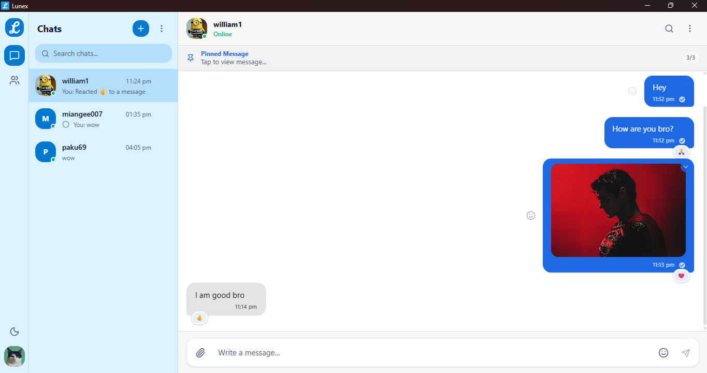

<div align="center">

  <h1>
    
    Lunex
  </h1>
  <p><strong>A private, encrypted, real-time desktop chat — built on Tauri, React, and Convex.</strong></p>
  <p>
    <a href="https://github.com/miangee21/Lunex/releases/latest">
      
    </a>
    <a href="https://github.com/miangee21/Lunex/blob/master/LICENSE">
      
    </a>
    <a href="https://github.com/miangee21/Lunex/stargazers">
      
    </a>
    
    
    <a href="https://www.patreon.com/posts/buy-me-virtual-153341450" target="_blank" rel="noopener noreferrer">
      
    </a>
  </p>

  <p>
    <a href="#-installation">📦 Install</a> ·
    <a href="#-features">✨ Features</a> ·
    <a href="#-self-hosting">🚀 Self Host</a> ·
    <a href="#-building-from-source">🔨 Build</a> ·
    <a href="#-project-structure">🗂️ Structure</a> ·
    <a href="https://lunex-app.vercel.app" target="_blank" rel="noopener noreferrer">🌐 Website</a> ·
    <a href="https://discord.gg/Av8CPpQXkB" target="_blank" rel="noopener noreferrer">💬 Discord</a>
    <a href="https://www.patreon.com/posts/buy-me-virtual-153341450" target="_blank" rel="noopener noreferrer">❤️ Support</a>
  </p>
</div>

 

## Table of Contents

- [Overview](#-overview)
- [Installation](#-installation)
- [Features](#-features)
  - [End-to-End Encryption](#-end-to-end-encryption)
  - [Real-time Messaging](#-real-time-messaging)
  - [Media Sharing](#-media-sharing)
  - [Message Management](#-message-management)
  - [Privacy Controls](#-privacy-controls)
  - [Privacy by Default — Zero-Knowledge Session Model](#-privacy-by-default--zero-knowledge-session-model)
  - [App Lock](#-app-lock)
  - [Disappearing Messages](#-disappearing-messages)
  - [Chat Themes](#-chat-themes)
  - [Notifications](#-notifications)
  - [System Tray](#-system-tray)
  - [Auto Updater](#-auto-updater)
  - [In-Chat Search](#-in-chat-search)
  - [Starred Messages](#-starred-messages)
  - [Friend System](#-friend-system)
  - [Pinned Messages](#-pinned-messages)
  - [Message Reactions](#-message-reactions)
- [Tech Stack](#-tech-stack)
- [Self Hosting](#-self-hosting)
- [Building from Source](#-building-from-source)
  - [Windows Build](#windows-build)
  - [Linux Build](#linux-build)
- [Project Structure](#-project-structure)
- [Convex Schema](#-convex-schema)
- [Cryptography](#-cryptography)
- [Contributing](#-contributing)
- [Roadmap](#-roadmap)
- [License](#-license)

---

## Overview

Lunex is a **native desktop chat application** built with privacy and security as first principles. Every message, every media file, every emoji reaction is encrypted end-to-end using NaCl box cryptography before it ever touches the server. Convex powers the real-time backend — but Convex itself never sees plaintext. Your data belongs to you.

Lunex is built on [Tauri v2](https://tauri.app) (Rust + WebView), meaning it ships as a lean native binary not an Electron app bundled with a browser. The result is a fast, low-memory, native-feeling chat application for Windows and Linux.

---

## Installation

### Windows

**Via winget (recommended):**

```powershell
winget install lunex
```

**Via installer:**  
Download the latest `.msi` or `.exe` from the [Releases page](https://github.com/miangee21/Lunex/releases/latest) and run it.

### Linux

Download the package that matches your distribution from the [Releases page](https://github.com/miangee21/Lunex/releases/latest):

| Package     | Distro                                |
| ----------- | ------------------------------------- |
| `.AppImage` | Universal — works on any Linux distro |
| `.deb`      | Ubuntu, Debian, Linux Mint            |
| `.rpm`      | Fedora, openSUSE, RHEL                |

**AppImage (universal):**

```bash
chmod +x Lunex_*.AppImage
./Lunex_*.AppImage
```

**Debian / Ubuntu:**

```bash
sudo dpkg -i lunex_*.deb
```

**Fedora / openSUSE:**

```bash
sudo rpm -i lunex_*.rpm
```

---

## Features

### End-to-End Encryption

Every piece of data that leaves your device is encrypted before transmission. Lunex uses **NaCl box** (TweetNaCl) — the same cryptographic primitive used by Signal and WhatsApp for all message encryption.

**How it works:**

- On signup, each user generates an **asymmetric key pair** (public key + private key) derived from a BIP-39 mnemonic phrase (12 words)
- The private key (`secretKey`) never leaves your device and is never sent to Convex
- Messages are encrypted using **NaCl box** with the sender's private key and the recipient's public key this is Diffie-Hellman key exchange baked in
- Media files are encrypted with **AES-GCM** using a per-file random IV before upload
- Emoji reactions are individually encrypted before being stored
- Even the last message preview in the chat list is encrypted the server only ever stores ciphertext

**Key files:**

- `src/crypto/encryption.ts` — NaCl box encrypt/decrypt + AES-GCM symmetric encrypt/decrypt
- `src/crypto/keyDerivation.ts` — base64 encode/decode for key material
- `src/crypto/mediaEncryption.ts` — media file AES-GCM encryption/decryption
- `src/crypto/mnemonic.ts` — BIP-39 mnemonic generation and parsing
- `src/crypto/pinEncryption.ts` — PIN-based AES-GCM encryption for App Lock
- `src/crypto/dpEncryption.ts` — display picture (profile photo) encryption

---

### Real-time Messaging

Powered by [Convex](https://convex.dev) reactive queries. When a message is sent, all participants see it instantly via WebSocket subscription no polling required.

- Messages load with the **latest 30 messages** on chat open (paginated scroll to top loads older messages)
- Real-time **typing indicators** — see when the other person is typing
- **Read receipts** — Empty circle (sent), circle with one tick (delivered), filled circle with one tick (seen)
- **Delivery receipts** — messages are marked delivered when the recipient's app receives them
- Online/offline status is updated on app open, app close, system shutdown, and window hide

---

### Media Sharing

Send images, videos, and documents all encrypted before upload.

- Files are encrypted client-side with a random AES-GCM IV before being sent to Convex storage
- The encrypted blob and its IV are stored; only the recipient (who holds the correct private key) can decrypt
- **Media expiry** — media files on Convex are automatically deleted after **6 hours** via a cron job
- **Batch uploads** — multiple files sent in one message are grouped by `uploadBatchId` and displayed as a media grid
- Upload progress is tracked per-conversation in a pending uploads list shown above the input bar
- Supported types: `image`, `video`, `file`
- Media is decrypted in memory only when displayed never written to disk as plaintext

**Key files:**

- `src/hooks/useMediaUpload.ts` — file selection, encryption, upload, progress tracking
- `src/components/chat/media/PendingUploadsList.tsx` — in-progress upload display
- `convex/media.ts` — Convex storage URL generation
- `convex/cleanup.ts` — media expiry deletion function
- `convex/crons.ts` — scheduled cleanup every 6 hours

---

### Message Management

- **Edit messages** — edit your own sent messages; edited messages are marked with an "edited" label
- **Delete for me** — remove a message from your view only
- **Delete for everyone** — remove a message from both sides (hard delete on Convex)
- **Bulk delete** — enter select mode via context menu, select multiple messages, delete all at once
- **Reply to messages** — reply to any specific message; reply preview shows in the input bar
- **Message info** — see exact sent, delivery and read timestamps per recipient
- **Context menu** — right-click anywhere in the chat area for quick actions (select messages, close chat)

**Key files:**

- `src/components/chat/area/ChatAreaDeleteDialog.tsx` — delete confirmation dialog (for me / for everyone)
- `src/components/chat/area/ChatAreaContextMenu.tsx` — right-click context menu
- `src/components/chat/misc/MessageInfoPanel.tsx` — delivery/read info panel
- `src/hooks/useMessageSelection.ts` — bulk selection state and delete handlers
- `convex/messages.ts` — all message mutations (send, edit, delete, react, star, pin)

---

### Privacy Controls

Each user has granular privacy settings for four attributes, each independently configurable to:

- **Everyone** — visible to all users
- **Nobody** — hidden from all
- **Only these** — allowlist of specific contacts
- **All except** — blocklist of specific contacts

**Controllable attributes:**

- **Online status** — whether others see you as online or offline
- **Typing indicator** — whether others see "typing..."
- **Read receipts** — whether others see filled circle with one tick
- **Message notifications** — whether you appear as a notification sender

**Block list:**

- Block any user — they can no longer send you friend requests or messages
- Blocked users are listed in your profile panel and can be unblocked at any time

**Key files:**

- `src/components/sidebar/settings/SettingsPrivacySection.tsx` — privacy settings UI
- `src/components/sidebar/settings/PrivacySelectorModal.tsx` — everyone/nobody/only-these/all-except picker
- `src/components/sidebar/settings/ContactPicker.tsx` — contact picker for exception lists
- `convex/users.ts` — privacy field reads with exception enforcement
- `convex/friends.ts` — block/unblock, friend request mutations

---

### Privacy by Default — Zero-Knowledge Session Model

Lunex is designed so that **no sensitive data ever touches persistent storage by default.** The privacy model has two distinct tiers, and you choose which one fits your needs.

#### Tier 1 — Full Session Privacy (Default)

This is the default behaviour when App Lock is **disabled**.

Every time you open Lunex and log in with your 12-word mnemonic phrase, your private key is derived and held **exclusively in RAM** for that session. The moment you close the app, every trace of your identity your private key, your decrypted messages, your session state is gone. Nothing is written to disk. Nothing persists.

```
App opens → mnemonic entered → secretKey derived in RAM → session active
App closes → RAM cleared → secretKey gone → no trace left on device
```

**What this means in practice:**

- Every new session requires your 12-word phrase no shortcuts, no remembered state
- A forensic examination of your device's storage after closing the app finds nothing belonging to Lunex
- If someone steals your laptop while the app is closed, there is nothing to extract
- The system tray toggle interacts with this model: if you **enable system tray**, closing the window keeps the app running in the background (RAM still holds your session, app stays usable). If you **disable system tray**, closing the window terminates the process and wipes RAM full privacy on every close

#### Tier 2 — Persistent Session with App Lock (Opt-in)

If re-entering 12 words on every launch is inconvenient, you can opt into **App Lock** in Settings. This enables a 6-digit PIN that persists your session across app restarts without compromising your private key security.

Here is exactly what happens when you enable App Lock:

```
User enables App Lock → sets 6-digit PIN
  └→ secretKey (from RAM) is encrypted with AES-GCM using PIN as key source
        └→ encrypted key blob stored in Tauri plugin-store (OS-level secure storage)
              └→ RAM cleared of raw secretKey

App restarts → PIN lock screen shown
  └→ user enters 6-digit PIN
        └→ AES-GCM decrypt → secretKey recovered → loaded into RAM
              └→ session resumes — no mnemonic needed
```

**What this means in practice:**

- Your raw private key is **never stored in plaintext** — only as an AES-GCM encrypted blob
- The PIN itself is never stored anywhere — it is only used transiently as key material during decrypt
- Without the correct PIN, the encrypted blob is cryptographically useless
- App Lock also hides your profile picture and bio on the lock screen — the lock screen itself reveals nothing about whose app this is
- Auto-lock timers (1 min · 5 min · 30 min · 1 hr) re-engage the PIN screen after inactivity
- Upon logout, the user’s PIN is permanently cleared and the encrypted key material stored on the system is securely deleted.

#### Choosing between the two

|                             | Tier 1 (Default)     | Tier 2 (App Lock)       |
| --------------------------- | -------------------- | ----------------------- |
| Login required every launch | Yes — 12-word phrase | No — 6-digit PIN        |
| Private key on disk         | Never                | AES-GCM encrypted only  |
| Data after app close        | Zero                 | Encrypted key blob only |
| Best for                    | Maximum privacy      | Daily convenience       |

**Key files:**

- `src/store/authStore.ts` — secretKey lives here in RAM only (never persisted without App Lock)
- `src/crypto/pinEncryption.ts` — AES-GCM encrypt/decrypt of secretKey with PIN
- `src/store/appLockStore.ts` — App Lock enable state and auto-lock timer
- `src-tauri/src/lib.rs` — system tray toggle that controls whether close = exit or close = minimize

---

### App Lock

Protect your Lunex session with a **6-digit PIN**. When App Lock is enabled:

- A PIN lock screen covers the entire app on startup and after the auto-lock timer fires
- The mnemonic phrase is encrypted with AES-GCM using the PIN as the key source — the PIN itself is never stored anywhere
- **Auto-lock timers**: 1 minute, 5 minutes, 30 minutes, or 1 hour of inactivity
- Profile picture and bio are hidden on the lock screen (zero information leakage)
- Incorrect PIN entries show a shake animation with attempt feedback

**Key files:**

- `src/components/sidebar/settings/AppLockPanel.tsx` — App Lock settings (enable/disable, change PIN, timer)
- `src/components/sidebar/settings/AppLockPinPad.tsx` — 6-digit PIN pad component
- `src/components/sidebar/settings/AppLockTimerSection.tsx` — auto-lock timer radio selector
- `src/components/auth/PinLockScreen.tsx` — full-screen PIN entry overlay
- `src/store/appLockStore.ts` — `isAppLockEnabled`, `isLocked`, `autoLockTimer` state
- `src/crypto/pinEncryption.ts` — AES-GCM mnemonic encryption/decryption with PIN

---

### Disappearing Messages

Both participants in a conversation can enable disappearing messages.

**Available timers:** 1 hour · 6 hours · 12 hours · 1 day · 3 days · 7 days

When a timer is active:

- New messages sent after enabling automatically have a `disappearsAt` timestamp
- A Convex cron job runs periodically to hard-delete expired messages from the database
- The chat header shows a timer indicator when disappearing mode is active
- Either participant can change or disable the timer; changes are logged as a system message

**Global default** — users can set a default disappearing timer in Settings that applies to all new conversations automatically.

**Key files:**

- `src/components/chat/misc/DisappearingPicker.tsx` — timer picker panel
- `src/components/sidebar/settings/SettingsTimerSection.tsx` — global default timer setting
- `convex/conversations.ts` — `setDisappearingMode` mutation
- `convex/cleanup.ts` — expired message deletion
- `convex/crons.ts` — scheduled cleanup job

---

### Chat Themes

Per-conversation color customization. Each chat can have its own visual theme, independent of the global app theme.

**Customizable elements:**

- My message bubble color
- Other person's bubble color
- My message text color
- Other person's text color
- Chat background color
- Named preset themes

Themes are stored in Convex and sync across sessions automatically.

**Key files:**

- `src/components/chat/misc/ChatThemeCustomizer.tsx` — full theme editor (color pickers, preset grid)
- `src/hooks/useChatTheme.ts` — applies per-chat theme CSS variables to the chat area
- `src/store/themeStore.ts` — global app theme state (light/dark/system) + chat presets
- `convex/chatThemes.ts` — `getChatTheme` query, `setChatTheme` mutation

---

### Notifications

Native desktop notifications via Tauri's notification plugin.

- New message notifications fire when the app is in the background or when a different chat is open
- Notification content respects privacy settings — if the sender has disabled notification privacy, no notification is shown for their messages
- Notifications work on both Windows and Linux
- Clicking a notification brings the app window to focus

**Key files:**

- `src/hooks/useAppNotifications.ts` — subscribes to incoming messages and fires native OS notifications

---

### System Tray

Lunex minimizes to the system tray instead of closing — your chats stay connected in the background.

- **Left-click** the tray icon to show the window
- **Right-click** for a context menu: `Show/Hide Window` and `Exit`
- `Exit` fires a `system-shutdown` event that sets your status to offline before quitting cleanly
- **Tray icon toggle** — Turn ON or OFF System tray
- The `toggle_tray` Tauri command controls tray icon visibility from the frontend

**Key files:**

- `src-tauri/src/lib.rs` — tray setup, menu items, click handlers, close-to-tray window event
- `src/pages/ChatPage.tsx` — listens for `system-shutdown` to set offline before quit

---

### Auto Updater

Lunex checks for updates automatically using Tauri's updater plugin.

- All updates are **cryptographically signed** with a private key — only official builds can be installed
- `updater.json` in the repo root describes the latest version, download URLs, and per-platform signatures
- On startup, Lunex checks the updater endpoint; if a newer version is available, the user is prompted to install and restart
- Three versions have been released and the update chain is live and tested

**Key files:**

- `updater.json` — update manifest (version, platforms, download URLs, signatures)
- `src-tauri/src/lib.rs` — `tauri_plugin_updater` registration
- `src-tauri/Cargo.toml` — `tauri-plugin-updater = "2"` dependency

---

### In-Chat Search

Search through messages within any open conversation directly from the chat header.

- Click the **Search** icon in the chat header to open the search panel (slides in from the right)
- Type any query — results filter in real-time from the currently loaded decrypted messages
- Each result shows the sender name, timestamp, and the matched text highlighted in context
- Click any result to **jump** to that message — it scrolls into view and briefly highlights
- The search panel is a full sidebar panel, separate from the profile/info panel

> **Note:** Search currently covers messages loaded in the current session. Full-history search across all messages is planned for a future release.

**Key files:**

- `src/components/chat/misc/ChatSearchPanel.tsx` — search UI, real-time filtering, jump-to-message
- `src/components/chat/misc/ChatHeader.tsx` — Search icon button that opens the panel
- `src/store/chatStore.ts` — `searchPanelOpen` state, `currentDecryptedMessages` for search

---

### Starred Messages

Star any message to save it for later reference. All starred messages are accessible from the sidebar.

- Use the message context menu to star or unstar a message
- The **Starred Messages** panel (accessible from the 3 Dots Menu) shows all starred messages across all conversations, sorted by time
- Each entry shows the conversation it came from, the sender, the timestamp, and the message content
- Starring state is stored in Convex on the `starredBy` array of the message document

**Key files:**

- `src/components/sidebar/StarredMessagesPanel.tsx` — starred messages list with jump-to-chat
- `convex/messages.ts` — `starMessage` / `unstarMessage` mutations

---

### Friend System

Lunex uses a friend-request model — you must be friends with someone before you can open a conversation.

- **Search users** by username from the Requests Page Find tab
- Send a **friend request** — the recipient sees it in their Requests Page Received tab
- Accept or reject incoming requests
- Once accepted, a conversation is automatically created and appears in both users' chat lists
- **Block** any user from their profile panel or from the blocked list in Settings
- Blocked users cannot send friend requests to you and cannot message you

**Key files:**

- `src/components/friends/` — friend request UI cards
- `src/components/chat/list/ChatList.tsx` — tabs: Chats / Requests / Search
- `convex/friends.ts` — `sendFriendRequest`, `acceptFriendRequest`, `rejectFriendRequest`, `blockUser`, `unblockUser`
- `convex/conversations.ts` — `createConversation` (called automatically on friend accept)

---

### Pinned Messages

Pin important messages in a conversation for quick reference.

- Use the message context menu to pin or unpin a message
- You can pin a maximum of 3 messages in one chat
- Pinned messages appear in a **pinned bar** at the top of the chat area, below the header
- If multiple messages are pinned, the bar cycles through them on each click with a counter indicator
- Clicking the pinned bar jumps the scroll position to that message
- Pinned message IDs are stored in the `conversations.pinnedMessages` array on Convex

**Key files:**

- `src/components/chat/area/ChatAreaPinnedBar.tsx` — pinned message bar with cycle navigation
- `convex/messages.ts` — `pinMessage` / `unpinMessage` mutations

---

### Message Reactions

React to any message with any emoji.

- Hover on a message to open the emoji reaction bar
- Reactions are **individually encrypted** — each emoji is AES-GCM encrypted before being stored on Convex
- Each message shows a reaction summary (emoji + count) below the bubble
- Remove your own reaction by clicking it again
- The last reaction in a conversation is stored on the conversation document for quick display in the chat list

**Key files:**

- `src/components/chat/bubble/` — message bubble with reaction display and picker trigger
- `convex/messages.ts` — `addReaction` / `removeReaction` mutations with encrypted emoji storage

---

## Tech Stack

| Layer                  | Technology                                                                                                            |
| ---------------------- | --------------------------------------------------------------------------------------------------------------------- |
| Desktop runtime        | [Tauri v2](https://tauri.app) (Rust)                                                                                  |
| Frontend framework     | [React 19](https://react.dev) + [TypeScript](https://www.typescriptlang.org)                                          |
| Build tool             | [Vite 7](https://vitejs.dev)                                                                                          |
| Backend / real-time DB | [Convex](https://convex.dev)                                                                                          |
| Styling                | [Tailwind CSS v4](https://tailwindcss.com)                                                                            |
| UI components          | [shadcn/ui](https://ui.shadcn.com) + [Radix UI](https://radix-ui.com)                                                 |
| State management       | [Zustand v5](https://zustand-demo.pmnd.rs)                                                                            |
| Routing                | [React Router v7](https://reactrouter.com)                                                                            |
| Cryptography           | [TweetNaCl](https://tweetnacl.js.org) + Web Crypto API (AES-GCM)                                                      |
| Mnemonic / key gen     | [@scure/bip39](https://github.com/paulmillr/scure-bip39) + [@noble/hashes](https://github.com/paulmillr/noble-hashes) |
| Icons                  | [Lucide React](https://lucide.dev)                                                                                    |
| Toasts                 | [Sonner](https://sonner.emilkowal.ski)                                                                                |
| Emoji picker           | [emoji-picker-react](https://github.com/ealush/emoji-picker-react)                                                    |
| PIN input              | [input-otp](https://github.com/guilhermerodz/input-otp)                                                               |
| Date utilities         | [date-fns](https://date-fns.org)                                                                                      |
| Tauri plugins          | shell, notification, updater, process, fs, dialog, opener, store                                                      |

---

## Self Hosting

You will need:

- [Node.js](https://nodejs.org) v20+
- [Rust](https://www.rust-lang.org/tools/install) stable toolchain
- A free [Convex](https://convex.dev) account

### Step 1 — Clone and install

```bash
git clone https://github.com/miangee21/Lunex.git
cd Lunex
npm install
```

### Step 2 — Set up Convex (development)

In **Terminal 1**, start the Convex dev server:

```bash
npx convex dev
```

- You will be prompted to log in to Convex (browser opens)
- Select **Create a new project**, name it `lunex` or `my-chat-app`
- Convex automatically creates `.env.local` in your project root with your dev deployment URL

### Step 3 — Run the app in development

In **Terminal 2**, start the Tauri dev build:

```bash
npx tauri dev
```

The app window will open. Create accounts, add friends, and send messages — everything is fully functional in development mode.

### Step 4 — Deploy Convex to production

1. Go to your [Convex Dashboard](https://dashboard.convex.dev)
2. Open your project → click the **Production** tab
3. Under **Settings**, copy these three values:
   - **Production Deploy Key** — looks like `prod:f...`
   - **Convex URL** — looks like `https://f***.convex.cloud`
   - **Convex Site URL** — looks like `https://f***.convex.site`

4. Create `.env.production` in your project root:

```dotenv
VITE_CONVEX_URL="https://f*********************.convex.cloud"
VITE_CONVEX_SITE_URL="https://f*******************.convex.site"
```

### Step 5 — Generate signing keys

Tauri requires all distributed builds to be cryptographically signed. Generate your key pair:

```bash
npx tauri signer generate
```

You will be prompted to set a **password** — choose a strong one and save it somewhere safe. You will need it every time you produce a release build.

Tauri outputs a **private key** and a **public key**. Save both.

Create `.env` in your project root:

```dotenv
TAURI_SIGNING_PRIVATE_KEY="your_private_key_here"
TAURI_SIGNING_PRIVATE_KEY_PASSWORD="your_password_here"
```

> **Important:** Add `.env` to your `.gitignore`. Never commit your signing private key to version control.

### Environment file summary

After completing setup you will have exactly **3 env files** in your project root:

| File              | Purpose                   | Created by                            |
| ----------------- | ------------------------- | ------------------------------------- |
| `.env.local`      | Dev Convex deployment URL | Convex CLI (auto-generated in Step 2) |
| `.env.production` | Production Convex URLs    | You (Step 4)                          |
| `.env`            | Tauri signing keys        | You (Step 5)                          |

---

## Building from Source

### Prerequisites

- Node.js v20+
- Rust stable toolchain — run `rustup update stable`
- **Linux only:** install system libraries first:

```bash
# Ubuntu / Debian
sudo apt install libwebkit2gtk-4.1-dev libssl-dev libgtk-3-dev libayatana-appindicator3-dev librsvg2-dev

# Fedora
sudo dnf install webkit2gtk4.1-devel openssl-devel gtk3-devel libappindicator-gtk3-devel librsvg2-devel
```

---

### Windows Build

Open **PowerShell** in the project root. Run these commands **in order**:

```powershell
# 1. Deploy Convex schema and functions to production
$env:CONVEX_DEPLOY_KEY="prod:f**********************************"
npx convex deploy

# 2. Set signing key environment variables
$env:TAURI_SIGNING_PRIVATE_KEY="your_private_key_here"
$env:TAURI_SIGNING_PRIVATE_KEY_PASSWORD="your_password_here"

# 3. Build the app
npx tauri build
```

**Output files** (inside `src-tauri/target/release/bundle/`):

| File                             | Description               |
| -------------------------------- | ------------------------- |
| `msi/Lunex_x.x.x_x64_en-US.msi`  | Windows Installer package |
| `nsis/Lunex_x.x.x_x64-setup.exe` | NSIS installer executable |

---

### Linux Build

> The Convex production deployment only needs to be done once. If you already ran `npx convex deploy` on Windows, skip that step here.

Open a terminal in the project root:

```bash
# 1. Set signing key environment variables
export TAURI_SIGNING_PRIVATE_KEY="your_private_key_here"
export TAURI_SIGNING_PRIVATE_KEY_PASSWORD="your_password_here"

# 2. Build the app
npx tauri build
```

If you encounter AppImage build errors, use this alternative command:

```bash
NO_STRIP=1 APPIMAGE_EXTRACT_AND_RUN=1 npm run tauri build
```

**Output files** (inside `src-tauri/target/release/bundle/`):

| File                                  | Description                      |
| ------------------------------------- | -------------------------------- |
| `appimage/lunex_x.x.x_amd64.AppImage` | Universal Linux portable app     |
| `deb/lunex_x.x.x_amd64.deb`           | Debian / Ubuntu package          |
| `rpm/lunex-x.x.x-1.x86_64.rpm`        | Fedora / openSUSE / RHEL package |

---

## Project Structure

```
Lunex/
├── .github/
│   └── assets/
│       └── app.png                        # App screenshot for README
├── convex/                                # Convex backend (serverless functions + schema)
│   ├── schema.ts                          # Database schema (all tables and indexes)
│   ├── messages.ts                        # Message CRUD, reactions, starring, pinning
│   ├── conversations.ts                   # Conversation creation, disappearing mode
│   ├── users.ts                           # User queries, privacy, profile, online status
│   ├── friends.ts                         # Friend requests, blocking
│   ├── chatThemes.ts                      # Per-chat theme get/set
│   ├── media.ts                           # Convex storage URL generation
│   ├── typing.ts                          # Typing indicator set/clear
│   ├── presence.ts                        # Online/offline presence tracking
│   ├── cleanup.ts                         # Media expiry + disappearing message deletion
│   └── crons.ts                           # Scheduled jobs (cleanup every 6 hours)
├── src/                                   # React frontend
│   ├── main.tsx                           # App entry point (Convex provider setup)
│   ├── App.tsx                            # Root component (renders AppRouter)
│   ├── App.css                            # Global styles, custom scrollbar, theme tokens
│   ├── crypto/                            # All cryptographic operations
│   │   ├── encryption.ts                  # NaCl box + AES-GCM symmetric encrypt/decrypt
│   │   ├── keyDerivation.ts               # Base64 encode/decode for key material
│   │   ├── mediaEncryption.ts             # Media file AES-GCM encryption/decryption
│   │   ├── mnemonic.ts                    # BIP-39 mnemonic generation and parsing
│   │   ├── pinEncryption.ts               # PIN-based AES-GCM for App Lock
│   │   ├── dpEncryption.ts                # Display picture (profile photo) encryption
│   │   └── index.ts                       # Re-exports
│   ├── store/                             # Zustand global state stores
│   │   ├── authStore.ts                   # userId, username, publicKey, secretKey
│   │   ├── chatStore.ts                   # activeChat, sidebar views, panel states
│   │   ├── appLockStore.ts                # isAppLockEnabled, isLocked, autoLockTimer
│   │   ├── themeStore.ts                  # Global app theme + chat presets
│   │   └── settingsStore.ts               # Misc settings state
│   ├── hooks/                             # Custom React hooks
│   │   ├── useChatData.ts                 # Fetches raw messages, handles pagination
│   │   ├── useDecryptMessages.ts          # Decrypts raw messages into DecryptedMessage[]
│   │   ├── useChatScroll.ts               # Scroll container, scroll-to-bottom, load-on-top
│   │   ├── useChatTheme.ts                # Applies per-chat theme CSS variables
│   │   ├── useMessageSelection.ts         # Bulk selection state and delete handlers
│   │   ├── useMediaUpload.ts              # File encrypt, upload, and progress tracking
│   │   ├── useAppNotifications.ts         # Native desktop notifications on new messages
│   │   ├── useOnlineStatus.ts             # User presence (online/offline)
│   │   ├── useProfilePicUrl.ts            # Fetches and decrypts profile picture URL
│   │   └── useSecureAvatar.ts             # Secure avatar display with decryption
│   ├── pages/                             # Top-level page components
│   │   ├── ChatPage.tsx                   # Main app layout (SlimBar + sidebar + chat area)
│   │   ├── LoginPage.tsx                  # Login with username + mnemonic phrase
│   │   ├── SignupPage.tsx                 # New account creation (key pair + mnemonic)
│   │   └── SplashPage.tsx                 # Initial loading splash screen
│   ├── routes/
│   │   └── AppRouter.tsx                  # Auth gate + App Lock PIN screen gate
│   ├── components/
│   │   ├── auth/
│   │   │   └── PinLockScreen.tsx          # Full-screen PIN entry when app is locked
│   │   ├── chat/
│   │   │   ├── area/                      # Main chat panel
│   │   │   │   ├── ChatArea.tsx           # Chat area root component
│   │   │   │   ├── MessageList.tsx        # Message list with media grid grouping
│   │   │   │   ├── ChatAreaPinnedBar.tsx  # Pinned message bar with cycle navigation
│   │   │   │   ├── ChatAreaDeleteDialog.tsx  # Bulk delete confirmation dialog
│   │   │   │   └── ChatAreaContextMenu.tsx   # Right-click context menu
│   │   │   ├── bubble/                    # Message bubble components
│   │   │   ├── input/                     # Chat input bar
│   │   │   │   └── ChatInput.tsx          # Input bar with send/emoji/attach/select mode
│   │   │   ├── list/                      # Chat list sidebar
│   │   │   │   └── ChatList.tsx           # Tabs: Chats / Requests / Search
│   │   │   ├── media/                     # Media components
│   │   │   │   └── PendingUploadsList.tsx # In-progress uploads display
│   │   │   └── misc/                      # Chat utility panels
│   │   │       ├── ChatHeader.tsx         # Chat header (avatar, name, online, actions)
│   │   │       ├── ChatSearchPanel.tsx    # In-chat message search panel
│   │   │       ├── ChatThemeCustomizer.tsx  # Per-chat color theme editor
│   │   │       ├── DisappearingPicker.tsx   # Disappearing message timer picker
│   │   │       ├── MessageInfoPanel.tsx     # Delivery/read timestamps panel
│   │   │       └── MessageStatusTick.tsx    # Sent/delivered/read tick component
│   │   ├── friends/                       # Friend request UI components
│   │   ├── profile/                       # Profile panels
│   │   │   ├── MyProfilePanel.tsx         # Your own profile editor
│   │   │   └── OtherUserPanel.tsx         # Other user's profile view
│   │   ├── sidebar/                       # Sidebar components
│   │   │   ├── SlimBar.tsx                # Narrow icon bar (leftmost column)
│   │   │   ├── AvatarMenu.tsx             # Avatar click dropdown menu
│   │   │   ├── DotsMenu.tsx               # Three-dot dropdown menu
│   │   │   ├── AboutPanel.tsx             # About / version info panel
│   │   │   ├── StarredMessagesPanel.tsx   # All starred messages list
│   │   │   └── settings/                  # Settings sub-panels
│   │   │       ├── SettingsPanel.tsx      # Main settings root
│   │   │       ├── SettingsPrivacySection.tsx  # Privacy toggles
│   │   │       ├── SettingsTimerSection.tsx    # Global disappearing timer
│   │   │       ├── AppLockPanel.tsx        # App Lock settings
│   │   │       ├── AppLockPinPad.tsx       # 6-digit PIN pad component
│   │   │       ├── AppLockTimerSection.tsx # Auto-lock timer selector
│   │   │       ├── PrivacySelectorModal.tsx  # everyone/nobody/only-these picker
│   │   │       └── ContactPicker.tsx       # Contact picker for exception lists
│   │   ├── shared/                        # Shared utility components
│   │   │   └── LunexLogo.tsx              # App logo component
│   │   └── ui/                            # shadcn/ui primitives
│   ├── types/
│   │   └── chat.ts                        # DecryptedMessage, ActiveChat, and core types
│   └── lib/
│       └── utils.ts                       # cn() utility (tailwind-merge + clsx)
├── src-tauri/                             # Tauri Rust backend
│   ├── src/
│   │   ├── main.rs                        # Binary entry point
│   │   └── lib.rs                         # App setup: tray, plugins, commands, window events
│   ├── capabilities/                      # Tauri permission definitions
│   ├── icons/                             # App icons (all sizes, all platforms)
│   ├── Cargo.toml                         # Rust dependencies
│   └── tauri.conf.json                    # Tauri config (bundle ID, window, updater)
├── public/                                # Static assets
├── updater.json                           # Auto-update manifest
├── index.html                             # Vite HTML entry point
├── vite.config.ts                         # Vite configuration
├── tsconfig.json                          # TypeScript configuration
└── package.json                           # npm dependencies and scripts
```

---

## Convex Schema

All sensitive fields (message content, IVs, reactions) are stored as ciphertext — Convex never receives or stores plaintext.

| Table              | Purpose                            | Key fields                                                                                    |
| ------------------ | ---------------------------------- | --------------------------------------------------------------------------------------------- |
| `users`            | User accounts and settings         | `username`, `publicKey`, `isOnline`, `lastSeen`, privacy settings                             |
| `conversations`    | Chat sessions between two users    | `participantIds`, `disappearingMode`, `pinnedMessages`, `lastMessageAt`                       |
| `messages`         | All messages                       | `encryptedContent`, `iv`, `type`, `sentAt`, `readBy`, `deliveredTo`, `reactions`, `starredBy` |
| `friendRequests`   | Pending/accepted/rejected requests | `fromUserId`, `toUserId`, `status`                                                            |
| `blockedUsers`     | Blocked user pairs                 | `blockerId`, `blockedId`                                                                      |
| `typingIndicators` | Real-time typing state             | `conversationId`, `userId`, `isTyping`, `updatedAt`                                           |
| `chatDeletions`    | "Delete for me" history            | `conversationId`, `userId`, `deletedAt`                                                       |
| `chatThemes`       | Per-chat color themes              | `userId`, `otherUserId`, bubble colors, text colors, preset name                              |

**Key indexes:**

- `messages.by_conversation` on `[conversationId, sentAt]` — efficient paginated message loading
- `messages.by_expires` on `[mediaExpiresAt]` — media cleanup cron target
- `messages.by_disappears` on `[disappearsAt]` — disappearing message cleanup
- `users.by_username` — username search
- `friendRequests.by_pair` — duplicate request prevention
- `chatDeletions.by_user_conversation` — fast "delete for me" filtering per chat

---

## Cryptography

Lunex's security model treats the Convex server as **untrusted**. Everything sensitive is encrypted before it leaves your device.

### Key generation (signup)

```
BIP-39 mnemonic (12 words)
  └→ SHA-512 hash (via @noble/hashes)
        └→ first 32 bytes  →  NaCl secretKey (private key)
              └→ NaCl box.keyPair.fromSecretKey()  →  publicKey
```

The `publicKey` is uploaded to Convex. The `secretKey` is derived fresh from the mnemonic on each login and kept only in memory (`authStore`). The mnemonic is shown once at signup and never stored by the app unless App Lock is enabled — in which case it is AES-GCM encrypted with the PIN before storage.

### Message encryption

```
sender secretKey + recipient publicKey
  └→ NaCl box (Curve25519 DH + XSalsa20-Poly1305)
        └→ { encryptedContent (base64), iv (base64 nonce) }
              └→ stored in Convex messages table
```

### Media encryption

```
file bytes
  └→ crypto.getRandomValues(12 bytes)  →  IV
        └→ AES-GCM encrypt (secretKey[:32] as key)
              └→ encrypted blob  →  uploaded to Convex storage
                    └→ { mediaStorageId, mediaIv }  →  stored on message
```

### App Lock (PIN)

```
user PIN
  └→ AES-GCM key derivation
        └→ AES-GCM encrypt(mnemonic phrase)
              └→ stored in Tauri plugin-store (encrypted at rest)
                    → on unlock: AES-GCM decrypt → mnemonic → re-derive secretKey
```

---

## Contributing

Contributions are welcome. To contribute:

1. Fork the repository
2. Create a feature branch: `git checkout -b feat/my-feature`
3. Make your changes
4. Test with the dev build: `npx tauri dev`
5. Commit with a descriptive message: `git commit -m "feat: add my feature"`
6. Push and open a Pull Request

**Code conventions:**

- TypeScript strict mode — avoid `any`
- Components go in the appropriate subdirectory under `src/components/`
- New Convex queries and mutations go in the relevant file in `convex/`
- State goes in a Zustand store — no prop drilling for global state
- All user data passed to Convex must be encrypted client-side first

---

## Roadmap

These features are actively planned and will be added in upcoming releases.

|     | Feature                                  | Status            |
| --- | ---------------------------------------- | ----------------- |
| ⬜  | Local Database — Offline Message Storage | 🔄 In Development |
| ⬜  | Mobile App                               | 📋 Planned        |

### Local Database — Offline Message Storage

> **Status:** In development

Lunex currently requires an active connection to Convex to load messages. The local database layer will change this fundamentally — bringing Lunex closer to the offline-first experience of WhatsApp and Signal.

**What it will enable:**

- Open any conversation and read your full message history with **no internet connection**
- Instant chat load from local cache — Convex sync happens in the background
- Full-history **in-chat search** across every message ever received, not just the current session's loaded batch
- **Offline send queue** — messages composed while offline are saved locally and automatically delivered the moment connectivity is restored
- **Media persistence** — media files deleted from Convex after 6 hours remain accessible locally as long as you choose to keep them
- **Sync period control** — choose to download the last 7, 15, or 30 days of history from Convex into local storage on first enable
- **Storage management UI** — see a breakdown of how much local space each conversation, image, video, and document is using, with per-category clear controls

**Technical approach:**

- SQLite via `tauri-plugin-sql` — embedded, zero-config, runs entirely on-device
- The SQLite file itself is encrypted at rest using **SQLCipher** (AES-256), keyed from your existing `secretKey` — no separate password required
- Messages are stored decrypted inside the encrypted file, enabling fast full-text search with a simple SQL `LIKE` or FTS5 index
- Local DB is only available when **App Lock is enabled** — this ensures the SQLCipher key is always PIN-protected and the database cannot be opened without your credentials
- An outbox table handles offline-sent messages with automatic retry and a sync status indicator in the UI

---

### Mobile App

> **Status:** Planned

A native mobile version of Lunex for Android and iOS, built on the same Tauri + React codebase.

**Planned scope:**

- Full feature parity with the desktop app — end-to-end encryption, disappearing messages, media sharing, app lock, and all privacy controls
- Same Convex backend — your account, contacts, and message history carry over seamlessly between desktop and mobile
- Native push notifications
- Biometric unlock (fingerprint / Face ID) as an alternative to PIN

---

## License

[MIT](./LICENSE) © 2026 Muhammad Hassan
